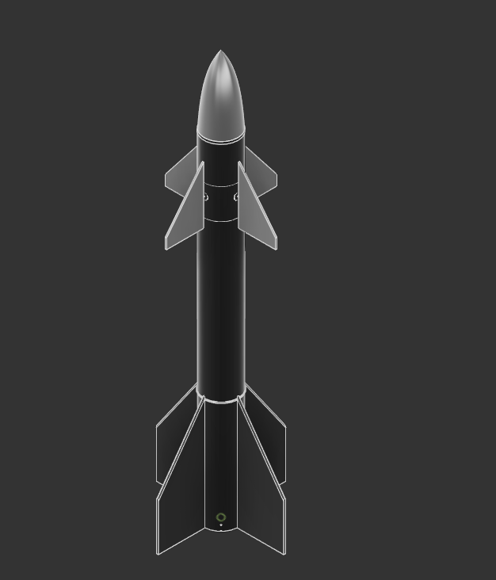
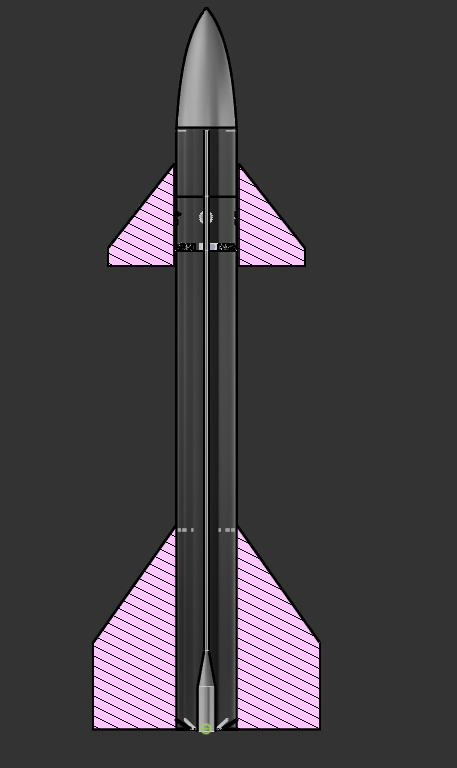

#  DIY Rocket with TVC & Active Fin Steering

This is my custom-designed rocket made in **Fusion 360**, featuring:

- Thrust Vector Control (TVC) using 2-axis servo-actuated rings
- Active fin steering system for stability & control
- Modular electronics bay (E-Bay) for guidance, telemetry, and recovery
- Designed for experimental testing with onboard sensor

---

##  Key Components

###  Thrust Vector Control (TVC)
- Dual-ring gimbal system for 2-axis movement (Pitch/Yaw)
- Controlled by two servos positioned 90° apart
- Motor is mounted in the inner ring
- Outer ring fixed to rocket body via pivots

###  Active Fin System
- Four CNC-style fins
- Mounted with servo-controlled rotation (each fin individually adjustable)
- Controlled via  Arduino with PID loop 

###  E-Bay (Electronics Bay)
- Houses all flight electronics:
  - IMU / Gyroscope
  - GPS module
  - Telemetry Radio (e.g., LoRa)
  - Parachute ejection system (planned)
- Designed for easy access and modular swaps

---

##  Build Material (Prototype)
- 3D printed parts (PLA / PETG for test prints)
- Carbon fiber tube for main fuselage 
- Aluminum or plywood for internal support and e-bay
- Screws, hinges, bearings as needed

---

## ⚠️ Disclaimer
This project is for educational and experimental purposes only. Any real-world testing must follow safety guidelines, local regulations, and common sense.

---

## 💬 Credits

Modeled fully in Fusion 360,

